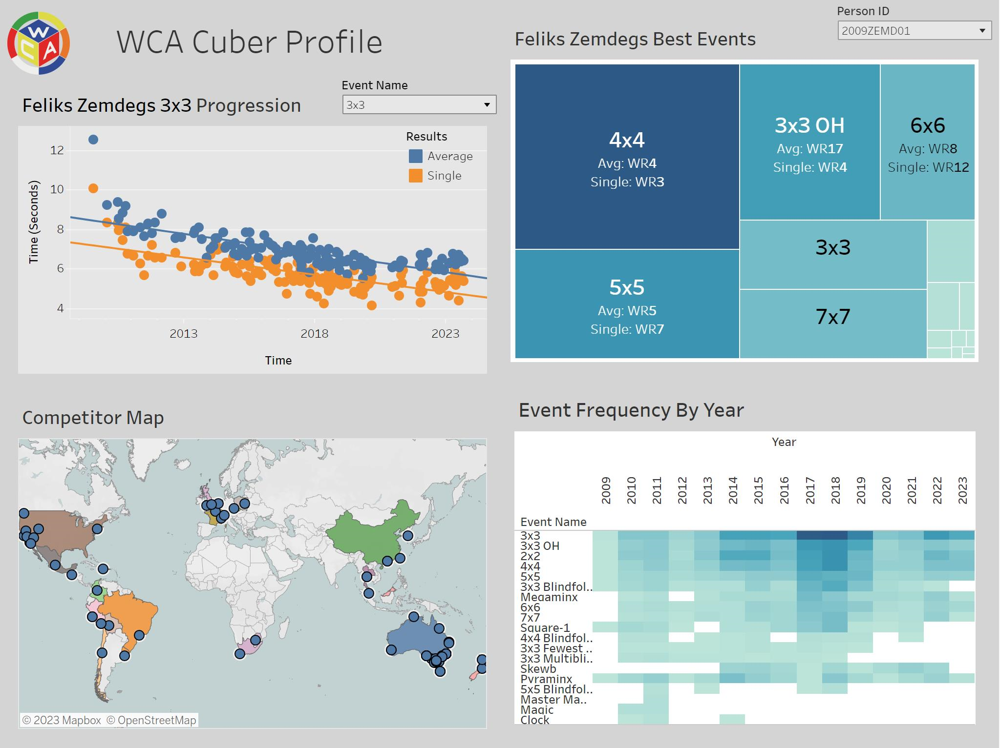
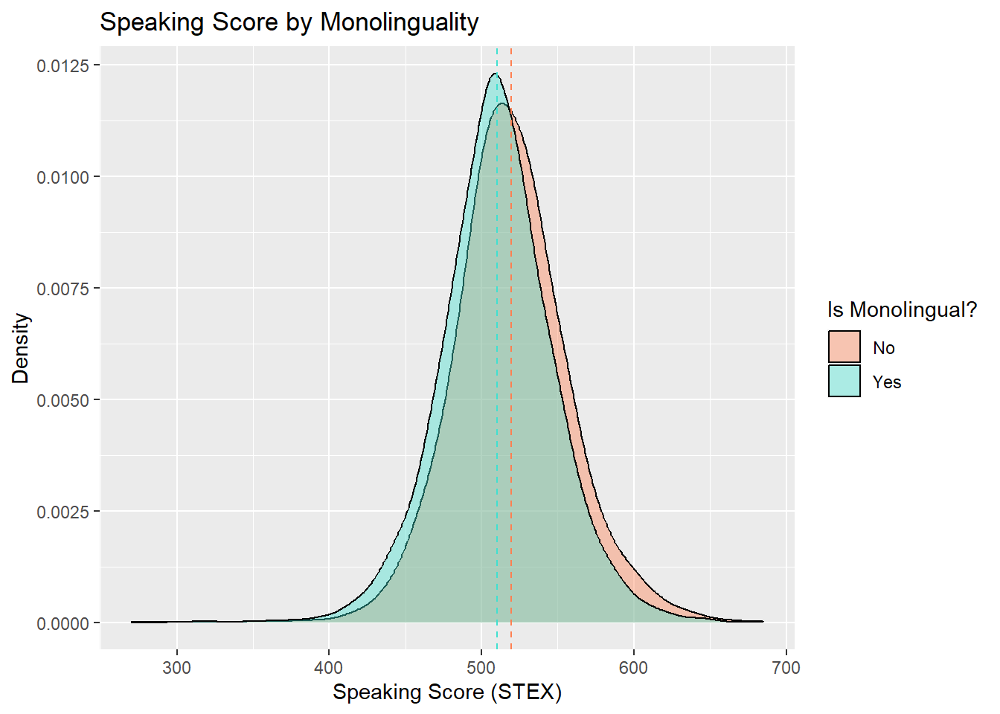
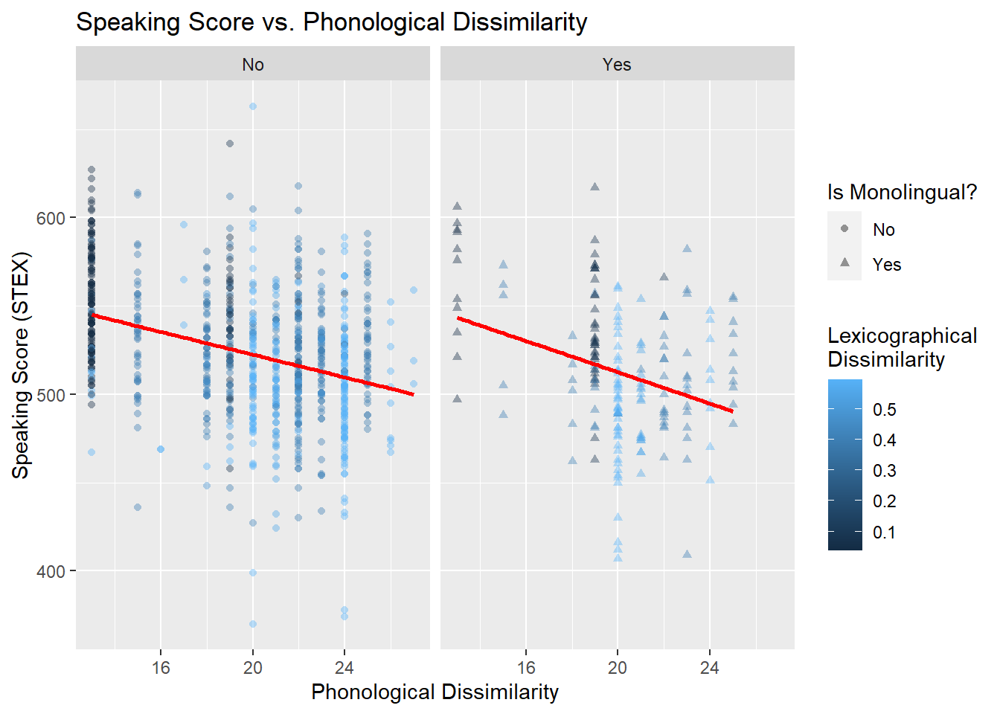
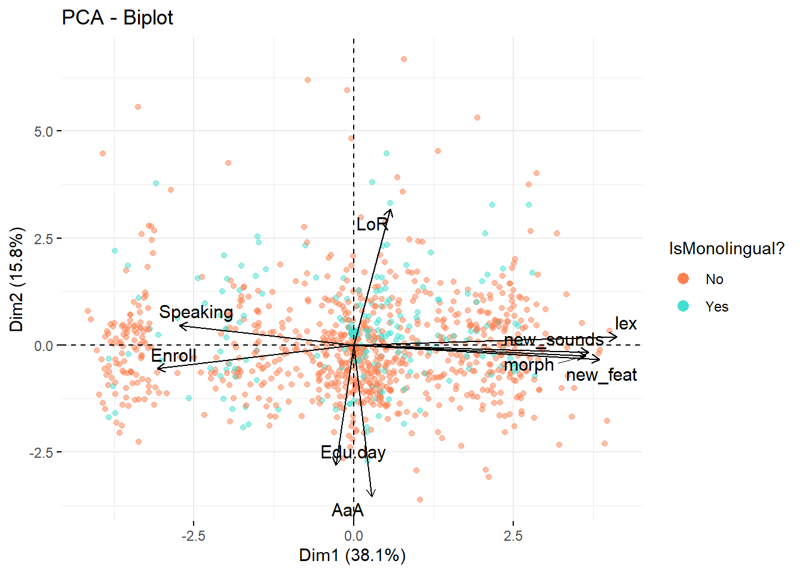

 

My name is Stanley and I'm studying Statistics, Machine Learning, and Computer Science at Carnegie Mellon Univeristy. I am passionate about statistics and data science and am constantly learning new skills to deepen my understanding and knowledge of data science. Here are some of the projects I have worked on in the past.

# Project 1: Stock Portfolio Tracker and Predictor
This Python project offers a comprehensive stock portfolio tracker with visualization and predictive capabilities. The project utilizes the Yahoo Finance API (yfinance) to fetch historical stock data for a given ticker. The system allows users to input stocks in the format "Ticker Share_Count YYYY-MM-DD" and tracks their portfolio's performance over time. Key features include:

**Portfolio Tracking:** The system keeps track of each stock's performance in the portfolio, including initial investment value, current value, and net profit/loss.

**Portfolio Visualization:** The system provides visualization tools to showcase the performance of individual stocks and the entire portfolio over time. It plots both actual and predicted stock prices, helping users gauge the effectiveness of the predictive model.

**Predictive Modeling:** The project implements a neural network predictive model using TensorFlow and LSTM layers to forecast future stock prices. The model takes historical data as input and provides predictions for the next day's closing price.

**Interactive Interface:** The program offers an interactive command-line interface where users can request stock predictions, view transaction history, calculate total net profit, and visualize portfolio profits.

**Limitations:** The current version has limitations, such as the inability to add more shares to an existing stock and removing stock shares.

The project aims to provide users with insights into their stock portfolio's performance, predictions, and trends using historical data and predictive modeling. The code is organized into classes for Stocks and Portfolios, promoting modularity and scalability.

For example , the following stocks were added to the portfolio in the form of 'ticker num_shares date_added': 
aapl 1 2020-01-01
tsla 2 2022-02-02
lcid 10 2021-12-20
nvda 1 2023-01-01
amzn 2 2021-12-31

Here is a visualization of the portfolio's profits over time.

Here is a visualization for predicted stock prices for Nvidia.

# Project 2: SQL + Tableau WCA Profile Dashboard

## Description:
The WCA Profile Dashboard is a data science project that combines SQL data extraction with Tableau visualization to provide a comprehensive view of speedcubing competition data for the top 1500 3x3 solvers. The project leverages SQL data extraction to provide relevant information and uses Tableau's powerful visualization capabilities to make the data accessible and interactive. It's designed to offer valuable insights for speedcubing enthusiasts and competitors, enabling them to explore performance trends, competition locations, and more. The data source used is the World Cube Association's official competition results exported from https://www.worldcubeassociation.org/export/results on September 29, 2023. 

You can explore the dashboard [HERE](https://public.tableau.com/shared/5YHFC529X?:display_count=n&:origin=viz_share_link).
## Key Features:

### SQL Data Extraction: 
The project involves SQL queries to extract and transform data from the WCA results database export using MySQL.

### Tableau Dashboard: 
The core of the project is a Tableau dashboard that allows users to interact with the data visually. The dashboard offers a user-friendly interface with dropdown functionality for selecting specific cubers or filtering by events.

### Tableau Visualizations:
- Scatterplot of Cuber Time Trends: The scatterplot displays the time trends of selected events over time, showing how their performance in various events has evolved.
- Heatmap of Event Frequency by Year: A heatmap visualizes the frequency of events competed in by year, helping users identify competitor trends and event preferences.
- World Map of Competition Locations: The map view pinpoints the locations of WCA competitions worldwide, providing a geographic perspective on cubing events and letting competitors .
- Tree Map for Best Events: The tree map illustrates a cuber's best events based on their world ranking, giving insights into their areas of expertise.
  
### Limitations
- Due to file size limitations in Tableau, the dashboard is limited to the top 1500 3x3 solvers. 

# Project 3: Factors Influencing Adult Language Learning

## Description:

This project seeks to investigate factors and trends that affect how adults are able to learn a foreign language. Using a [large dataset](https://zenodo.org/records/2863533#.Y9Y3pNJBwUE) consisting of anonymized data from the State Examination of Dutch as a Second Language, we created data visualizations and conducted statistical tests in ggplot2/R to answer our various research questions. Some visualizations and methodology include density plots, scatterplots, dendrograms, chloropleths, PCA analysis, ANOVA testing, and linear regression. We hope to generalize the results found here to better explain how one can learn to speak any new language better. This was a collaborative project where I worked with two other CMU students to produce a formal report of our findings linked [HERE](https://www.stat.cmu.edu/capstoneresearch/315files_f23/team24.html). 

## Visualizations:

  
  
  
  

# Project 4: Predicting NBA Career Outcomes

This project involves building a Random Forest Classification model to predict the career outcomes of NBA players based on their performance during their first four seasons in the league. 

## Frameworks Used:
- Pandas
- Matplotlib/Seaborn
- Sklearn: train_test_split, RandomForestClassifier, GridSearchCV

## Project Steps:

### Data Cleaning: 
- Read in the two datasets: 'awards_data.csv' containing awards/accolades information and 'player_stats.csv' containing player statistics. Merged them on player/season to get overall dataframe.
- Performed EDA on the loaded data to understand its structure and contents.
- Conducted data imputation by replacing null values with the mean and transforming categorical variables into numerical representations.

### Data Engineering
- Define the outcome classes for both season and career outcomes based on predefined guidelines (Elite, All-Star, Starter, Rotation, Roster, Out of the League).
- Split the data into two sets based on players' draft years: pre-2015 and post-2015 based on the requirements in our definition of career outcome.
- Aggregated player statistics over the first four seasons in the league to create features and training set for the model.

### Model Selection, Training, and Evaluation:
- Select a RandomForestClassifier as the model due to its ability to handle feature selection and thresholds effectively.
- Split the dataset into training and test sets for model evaluation.
- Use GridSearchCV for hyperparameter optimization to find the best model configuration.
- Train the RandomForestClassifier using the training data with the optimized hyperparameters.
- Evaluate the model's performance on both the training and test sets using accuracy metrics: training set accuracy > 90% while testing set accuracy is ~60%
- Prepared a dataset of post-2018 drafted players and predicted the probabilities each of their careers fell into each of the categories.

### Conclusion
This project demonstrates the application of a Random Forest Classification model to predict NBA players' career outcomes based on their first four seasons' performance. By carefully preprocessing the data, selecting relevant features, and optimizing the model, we achieved a ~60% accuracy in predicting career outcomes. The insights gained from this project can provide valuable information for NBA teams and analysts in making strategic decisions about player development and team building. Future improvements to the model involve using a larger training dataset, more selective feature selection, and other data engineering techniques to reduce the possibilities of overfitting.
